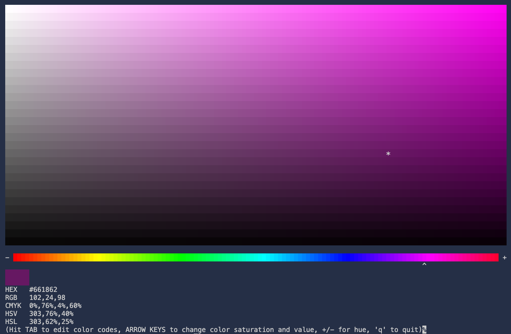

# terminal_color_picker
A small termial color picker useful for picking colors or converting to differnet formats



## usage
compile like so on linux or mac
```
gcc -std=c11 main.c -o color_picker
```

and then run like so
```
./color_picker
```

## Help/Contributing

If you find any bugs or have any problems, feel free to open an issue here https://github.com/wbf22/terminal_color_picker/issues

If you'd like to contribute, feel free to make a PR and we'll review it


